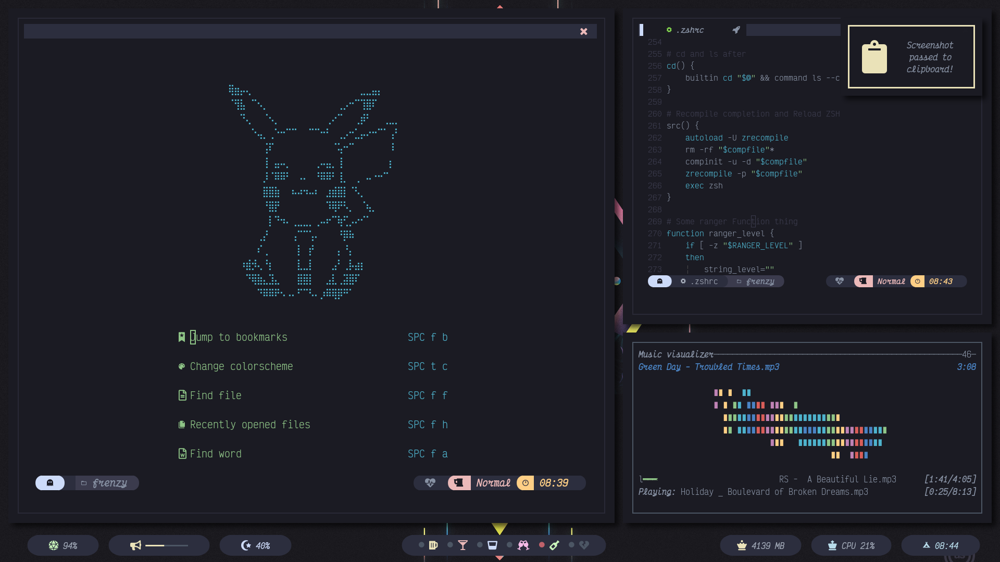
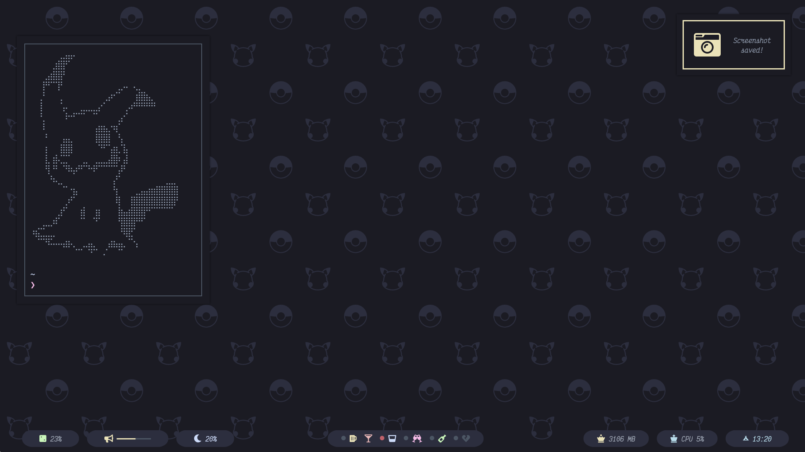

# dotfiles

  
  
  

<h3>Hi! These are my Dotfiles, its not much but is something </h3>

---

  

Please steal me, DO IT!!!!

JUST DO IT!!!

Oh Btw these dots are incomplete, sou, here's a quick screenshot of how it kinda looks, sort of:

