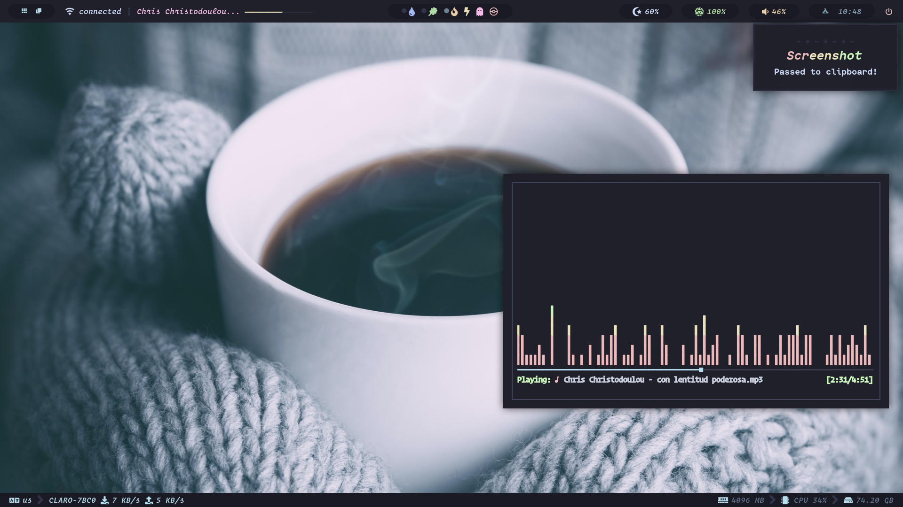

# ~/dotfiles

<p align="center">
    <a href="https://github.com/FrenzyExists/dotfiles/stargazers"></a>
    <a href="https://github.com/FrenzyExists/dotfiles/issues"></a>
    <a href="https://github.com/FrenzyExists/dotfiles/network/members"></a>
</p>

<h3 align="center">Hi! These are my dotfiles</h3>

---

<p>

### BSPWM

<p align="center">
  
</p>


## Wallpapers

* Check out [Wall Repo](https://github.com/FrenzyExists/wallpapers)!

## 💻 Installation

RUN THE **INSTALLATION SCRIPT**. **NOW**. ***STEAL THE DOTFILES.***

```
git clone https://github.com/FrenzyExists/dotfiles.git --depth=1 --branch=mozarrella
cd dotfiles
chmod +x install.sh
./install.sh
```
